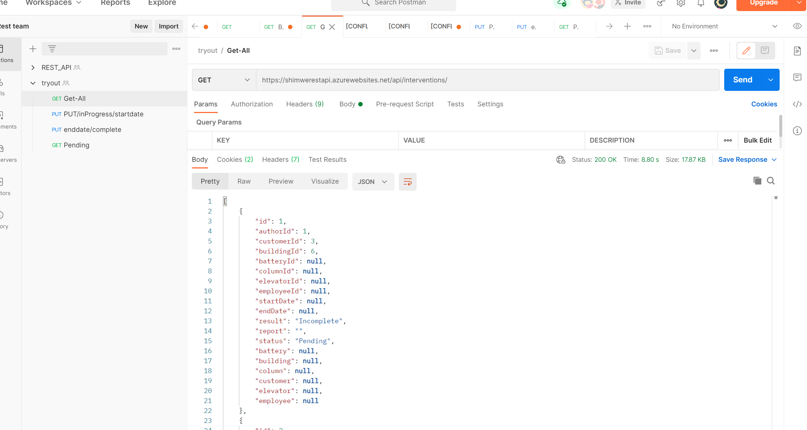
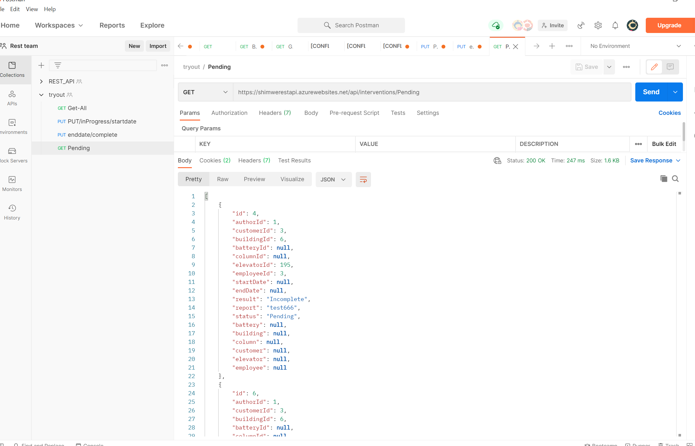
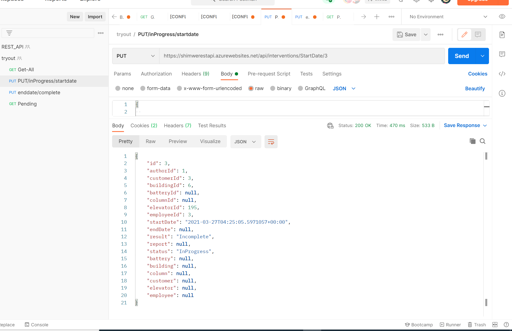
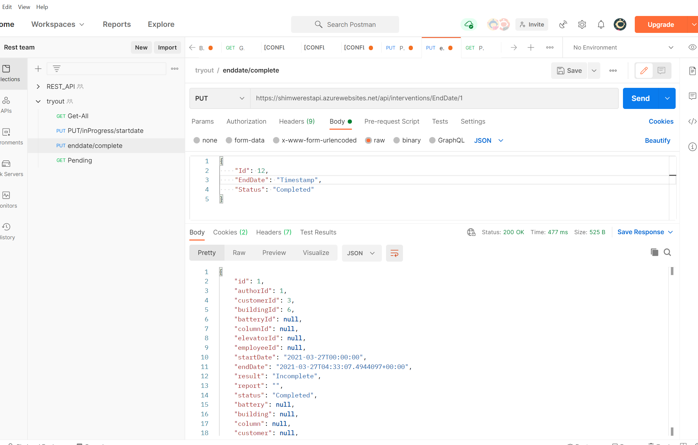

README.md

# Consolidation Week

---

For this week rest api Api.we have created endpoint for intervetion table.And you can have all the intervention.[url to verify in postman](https://shimwerestapi.azurewebsites.net/api/interventions/). 

GET for Returns all fields of all Service Request records that do not have a start date and are in "Pending" status.[url to verify in postman](https://shimwerestapi.azurewebsites.net/api/interventions/pending). 

PUT for Changing the status of the intervention(example intervention 3) request to "InProgress" and add a start date and time (Timestamp).
[url to verify in postman](https://shimwerestapi.azurewebsites.net/api/interventions/StartDate/3). 

PUT for Changing the status (example of intervention 1) of the request for action to "Completed" and add an end date and time (Timestamp).[url to verify in postman](https://shimwerestapi.azurewebsites.net/api/interventions/EndDate/1). 

For other specification please check my restapi url in postman. https://shimwerestapi.azurewebsites.net/api/interventions

# Week 8:Rest APIs

In this project we Created Rest Apis for Rocket Elevators. and the link for our differents Apis are below and you can test it in Postman here is example of how u can access our api

For Elevator to retrive, for example elevator with id==3, you use GET
https://sirinerocketelevatorsrestapi.azurewebsites.net/api/elevators/3 and for Changing ITS status you will use PUT and in Body => raw change on of elevator status ("Active" or "Inactive" or "Intervention") in Json format like this: { "status" : "Inactive" }

If the results input is Success, use GET to see the results of the changed status.

To get the elevators in Intervention use : https://sirinerocketelevatorsrestapi.azurewebsites.net/api/elevators/status/intervention, and to GET inactive you can use https://sirinerocketelevatorsrestapi.azurewebsites.net/api/elevators/status/inactive

2.This will be the same for Batteries and Columns. If you want to see all the batteries for example, use GET https://sirinerocketelevatorsrestapi.azurewebsites.net/api/Batteries , and for columns https://sirinerocketelevatorsrestapi.azurewebsites.net/api/Columns

to retrieve the information use the same link /(the id in numbers of the battery you want) for example here we want one so we use https://sirinerocketelevatorsrestapi.azurewebsites.net/api/Batteries/1 to change the information you do the same as abose USE PUT and choose in (Online, Offline or Intervention")

{

"Status": "Online" }

For The building if you want to get all the Buildings use GET https://sirinerocketelevatorsrestapi.azurewebsites.net/api/Buildings to get building that contain at least one battery, column or elevator requiring intervention https://sirinerocketelevatorsrestapi.azurewebsites.net/api/Buildings/Intervention

For the Lead, to Get all the Leads https://sirinerocketelevatorsrestapi.azurewebsites.net/api/Leads and to retrieve a list of Leads created in the last 30 days who have not yet become customers https://sirinerocketelevatorsrestapi.azurewebsites.net/api/Leads/30daysnotcustomers

So in more Details with Codes:

We Scaffolded our The entities which are the Models folder That we had in Mysql Server.and every model is a set of classes that represent the data that the app manages. for example in Batteries Class we have:

    public long Id { get; set; }
    public long? BuildingId { get; set; }
    public string Status { get; set; }
    public DateTime? DateCommissioning { get; set; }
    public DateTime? DateLastInspection { get; set; }
    public string CertificateOfOperations { get; set; }
    public string Information { get; set; }
    public string Notes { get; set; }
    public string BatteryType { get; set; }

We have a database context(InesIzereContext) is the main class that coordinates Entity Framework functionality for a data model.and for our Batteries Class, its relation is: modelBuilder.Entity(entity => { entity.ToTable("batteries");

            entity.HasIndex(e => e.BuildingId)
                .HasName("index_batteries_on_building_id");

            entity.Property(e => e.Id)
                .HasColumnName("id")
                .HasColumnType("bigint(20)");

            entity.Property(e => e.BatteryType)
                .HasColumnName("battery_type")
                .HasMaxLength(255);

            entity.Property(e => e.BuildingId)
                .HasColumnName("building_id")
                .HasColumnType("bigint(20)");

We use difference Controllers to expose Async API Endpoints for CRUD operations. For example in Batteries controller, [HttpGet("{id}")] public async Task<ActionResult> GetBattery(long id) { var battery = await \_context.Batteries.FindAsync(id);

        if (battery == null)
        {
            return NotFound();
        }

        return battery;
    }

And we can see the results our our request in Postman.
